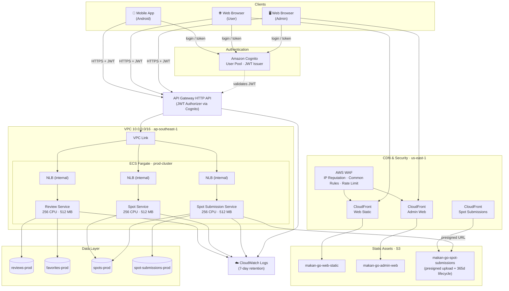
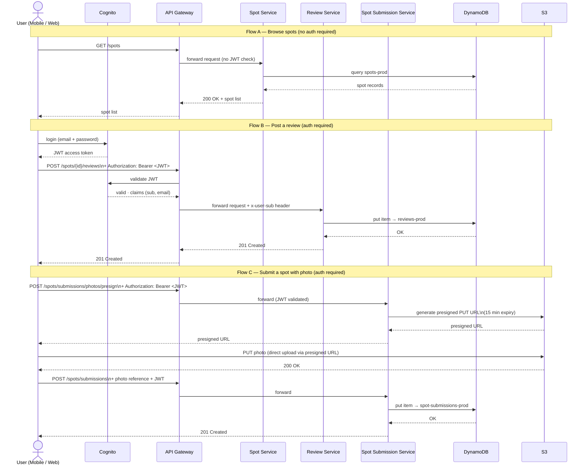
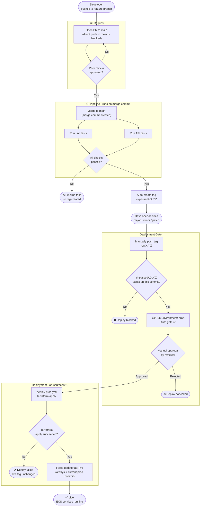

# Makan-Go Architecture Diagrams

> Rendered natively on GitHub. To use in Word/PowerPoint, paste the diagram source into [mermaid.live](https://mermaid.live), then export as PNG.

---

## 1. Cloud Architecture



---

## 2. Request Flow (Microservice Interaction)

Two representative flows are shown: a public read and an authenticated write.



---

## 3. CI/CD Pipeline

Based on the agreed tag-based promotion strategy (not yet fully implemented — see CLAUDE.md).



---

## Data Model (DynamoDB Tables)

```mermaid
erDiagram
    SPOTS {
        string id PK
    }

    REVIEWS {
        string id PK
        string userId
        string spotId
        string createdAt
    }

    FAVORITES {
        string userId PK
        string spotId SK
    }

    SPOT_SUBMISSIONS {
        string id PK
    }

    SPOTS ||--o{ REVIEWS : "reviewed via"
    SPOTS ||--o{ FAVORITES : "favourited via"
    SPOTS ||--o{ SPOT_SUBMISSIONS : "submitted as"
```
